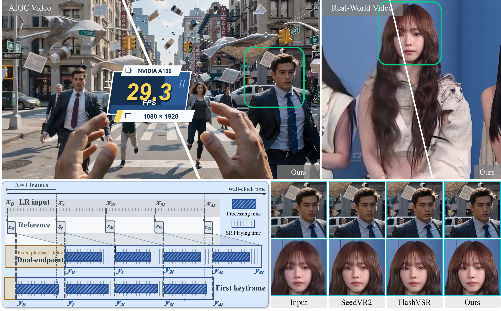

# RelayVSR

Inference code for [RelayVSR: Large-Small Model Collaboration for Efficient
Real-World Video Super-Resolution](https://arxiv.org/abs/2609.37850) by
Xijun Wang, Xin Li, Zirui Lang, Suhang Yao, Haoran Li, and Zhibo Chen.
RelayVSR performs collaborative streaming 4× video super-resolution with sparse
Wan references and a compact conditional decoder. This repository contains
inference code only.



## Demo

The input starts on the left and the 4× output on the right. The divider moves
from right to left until the output fills the frame.
The watermark strip is cropped from both views. The output area is not resized;
the MP4 is 3544×1832 at 24 fps with all 265 frames.
<video controls preload="metadata" width="100%" src="https://raw.githubusercontent.com/kopperx/RelayVSR/main/assets/demo/relayvsr-comparison.mp4"></video>

[Download the MP4](assets/demo/relayvsr-comparison.mp4)

## Setup

Linux, Python 3.11–3.13 and an NVIDIA GPU:

```bash
uv sync --locked --extra cu128
source .venv/bin/activate
```

## Inference

Download the two checkpoints from the
[Hugging Face repository](https://huggingface.co/kopper/RelayVSR) into `weights/`:

```bash
uvx hf download kopper/RelayVSR flash.safetensors wan.safetensors --local-dir weights
```

The expected paths are `weights/wan.safetensors` and
`weights/flash.safetensors`, resolved relative to `inference.py`.
The bundled `assets/demo/input.mp4` is used when `--input` is omitted.

```bash
python inference.py \
  --output output_x4.mp4
```

Pass `--input path/to/video.mp4` to process another video, or provide an
ordered image directory together with `--fps`.

The default Flash checkpoint is **S, step 60000, EMA**, trained with a two-frame
video attention window (current frame and one predecessor) and current-relative
temporal RoPE. Override either path with `--wan-checkpoint` or `--flash-checkpoint`.

- `--window-size 16`: generate reference endpoints every 15 frames. Increase
  this value to let the small model process more intermediate frames.
- `--fps 24`: override the input FPS; required for image directories.
- `--max-frames 100`: process at most 100 frames.
- `--dtype bf16`: inference precision; `fp16` and `fp32` are also supported.
- `--overwrite`: replace an existing output.

Video FPS is preserved. Output resolution is exactly 4× the input; audio is not
copied. Each model loads its own safetensors directly, without runtime adapter
merging. Both files contain their model configuration; the Wan file also contains
the prompt embeddings.

## Citation

```bibtex
@misc{wang2026relayvsr,
  title={RelayVSR: Large-Small Model Collaboration for Efficient Real-World Video Super-Resolution},
  author={Xijun Wang and Xin Li and Zirui Lang and Suhang Yao and Haoran Li and Zhibo Chen},
  year={2026},
  eprint={2609.37850},
  archivePrefix={arXiv},
  primaryClass={cs.CV},
  url={https://arxiv.org/abs/2609.37850}
}
```

## License

Apache-2.0. The Wan implementation retains its upstream copyright notice.
Acknowledgments: [Diffusers](https://github.com/huggingface/diffusers),
[Wan](https://github.com/Wan-Video/Wan2.2) and
[FlashVSR](https://github.com/OpenImagingLab/FlashVSR).
